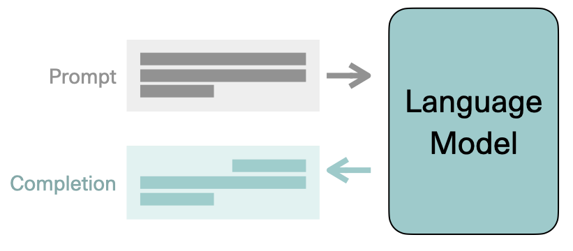

# LLM-API
A repository to demonstrate some of the concepts behind large language models, transformer (foundation) models, in-context learning, and prompt engineering using open source large language models like Bloom and co:here.

## Large language models and prompt engineering


**Table of contents**

- [Overview](#overview)
- [Objective](#objective)
- [Requirement](#requirement)
- [Install](#install)
- [Data](#data)
- [Features](#features)
- [How to use the API](#examples)
- [Pipelines](#pipelines)
- [Notebooks](#notebooks)
- [Scripts](#scripts)
- [Test](#test)
- [Author](#author)


## Overview
> As transformer (foundation models) were introduced around 2017, they quickly become the leading models to go too to win the race of NLP and computer vision. These models can practically be used to do any language-related tasks, such as but not limited to sentiment analysis, text extraction, text generation, chatbot applications, language translations, and many more.
>
> The main idea behind this week's project is to have a clear if not basic understanding of these large language models, prompt engineering, in-context learning, fine tuning and building an API to connect all of them and build a product that can even be used for a commercial use.


## Objective
> Is to build and end to end pipeline that can use some if not any of the large language models free APIs such as Bloom, GPT-3 or co:here, in order to use their capabilities and 
>
> 1- Extract the relationships and entities of an input job description.
>
> 2- Score whether or not specific input news is going to cause a problem in the real world based on a scoring value (feature).
>
> 3- Create an API that receives inputs and displays outputs for the above scoring and text extraction services. 
>
> 4- Make the whole project into an installable product available for commercial use.


## Requirement
> Python 3.5 and above, Pip and cohere, transformers
> 
> The visualization are made using plotly, seaborn and matplot lib


## Install

```
git clone https://github.com/Fisseha-Estifanos/LLM-API.git
cd LLM-API
pip install -r requirements.txt
```


## Data
### Dataset I: News and scores
> The news score data can be found here at : [google drive](https://docs.google.com/spreadsheets/d/19N_K6SnIm0FylD2TBs-5y3WeSgdveb3J/edit?usp=sharing&ouid=108085860825615283789&rtpof=true&sd=true)

### Dataset II: Job descriptions
> The development and training data set could be found in here at: [GitHub](https://github.com/walidamamou/relation_extraction_transformer/blob/main/relations_dev.txt)
> 
> The testing and final reporting data set could be found in here at: [GitHub](https://github.com/walidamamou/relation_extraction_transformer/blob/main/relations_test.txt)


## Features
### Features I: News and scores
> - Domain - the base URL or a reference to the source these item comes from 
> - Title - title of the item - the content of the item
> - Description - the content of the item
> - Body - the content of the item
> - Link - URL to the item source (it may not functional anymore sometime)
> - Timestamp - timestamp that this item was collected at
> - Analyst_Average_Score -  target variable - the score to be estimated 
> - Analyst_Rank - score as rank
> - Reference_Final_Score - Not relevant for now - it is a transformed quantity


### Features II: Job descriptions
> - Feature 1 - what it is
> - Feature 1 - what it is
> - Feature 3 - what it is


## Examples
>
>
>


## Pipelines
> Several numbers of pipelines are going to be used in this project. 
>
> The main pipeline that is going to be the main end to end pipeline is going to be formed using DVC.  


## Notebooks
> All the preparation, preprocessing, analysis, EDA and examples of several prompt engineering, in-context learning, large language API interactions and other types of several notebooks will be found here in the form of an .ipynb file, in the notebooks folder.


## Scripts
> All the modules for the EDA notebooks, analyses, helpers and any other scripts will be found here.


## Tests
> All the unit and integration tests are found here in the tests folder.


## Author
> 👤 **Fisseha Estifanos**
>
> - GitHub: [Fisseha Estifanos](https://github.com/fisseha-estifanos)
> - LinkedIn: [Fisseha Estifanos](https://www.linkedin.com/in/fisseha-estifanos-109ba6199/)
> - Twitter: [Fisseha Estifanos](https://twitter.com/f0x__tr0t)


## Show us your support
> Give us a ⭐ if you like this project, and also feel free to contact us at any moment.
